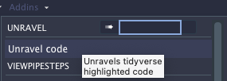
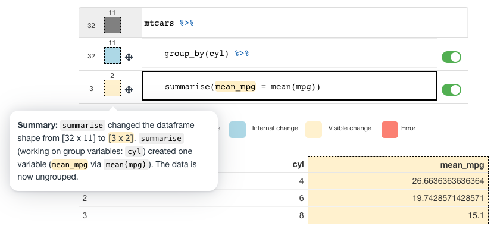

# Unravel: A fluent code explorer for R.

<!-- badges: start -->

[](https://www.tidyverse.org/lifecycle/#experimental)

<!-- badges: end -->

**NOTE:** The package is early on in its lifecycle and is still undergoing development. But, if you are ever so curious, you can install it with:

``` {.r}
devtools::install_github('nischalshrestha/Unravel')
```

Unravel is an R package / Addin designed to help data scientists understand and explore tidyverse R code which makes use of the fluent interface (function composition). You can read about the tool in my [paper](https://dl.acm.org/doi/10.1145/3472749.3474744) which covers its motivation, design, and results of a user study. Optionally, you can watch the [talk](https://youtu.be/wJ77e39XVEs) I gave at UIST 2021.

# Usage

With Unravel, you can unravel `dplyr` or `tidyr` code which opens up a Shiny app in RStudio. You can then hover over the lines to **inspect the intermediate outputs** (typically dataframes) of the tidyverse code. Both the code and output will be highlighted according to what type of **changes occurred** (no change, visible change, internal change, error).

Unravel also produces **automated function summaries** accessed through the dataframe box. Each function summary (if supported --- see below) describe how the function transformed the previous dataframe in terms of dimensions (shape), whether or not changes were visible or internal (for e.g. grouping).

You can also **perform structural edits** to the code via toggles (comment/uncomment), and reordering lines with drag and drop interactions.

Note: The first expression or line is treated as the data source, so the line in the UI is locked such that you can't reorder it and other operations can't be reordered before the first line.

### RStudio

The easiest way to use Unravel is through the Addin. Highlight the tidyverse code you want to unravel, then go to Addins -\> Unravel code.



You can also invoke it programmatically using the `unravel` function by wrapping or piping your code to the function:

``` {.r}
# wrapped
Unravel::unravel(
  mtcars %>%
    group_by(cyl) %>% 
    summarise(mean_mpg = mean(mpg))
)
# piped
mtcars %>%
  group_by(cyl) %>% 
  summarise(mean_mpg = mean(mpg)) %>%
  Unravel::unravel()
```



This will open up the app on the Viewer pane in RStudio by default. But, if you want to respect your currently chosen browser window, you can add a `viewer = FALSE`:

``` {.r}
mtcars %>%
  group_by(cyl) %>% 
  summarise(mean_mpg = mean(mpg)) %>%
  Unravel::unravel(viewer = FALSE)
```

Keep in mind, it's very early so trying things on your own code/data might not work.

### What verbs have summaries?

Currently, any `dplyr`/`tidyr` piped code working on single tables will work execution-wise, but only a handful of the functions in each package has explicit support for summaries / has been tested. The summaries are generated by an [extension](https://github.com/nischalshrestha/tidylog) package of the amazing original [tidylog](https://github.com/elbersb/tidylog) package.

In the extension, I have added some enhancements (like data shape summary for every verb and rephrasing summaries) and is specially designed to work with `Unravel` so that I can access the messages in a convenient cache. All verbs supported by `tidylog` besides `join`s will work and some more I added like `arrange`, `rowwise`.

# Related tools

There are several other similar tools that provide inspection and/or summary of tidyverse code operations and intermediates, which you may find useful as well:

- [tidylog](https://github.com/elbersb/tidylog): a drop-in solution that logs summaries of steps through `message()` on console output
- [ViewPipeSteps](https://github.com/daranzolin/ViewPipeSteps): an RStudio Addin that opens up tabs of intermediate outputs 
- [breakerofchains](https://github.com/MilesMcBain/breakerofchains): an RStudio/VSCode Addin that allows inspection of steps through cursor placement in editor
- [datamations](https://github.com/microsoft/datamations): a framework to generate and visualize pipeline steps through explanations/animations
- [Tidy Data Tutor](https://tidydatatutor.com): visualizations of tidyverse code focusing on visualizing how each step transforms dataframes
